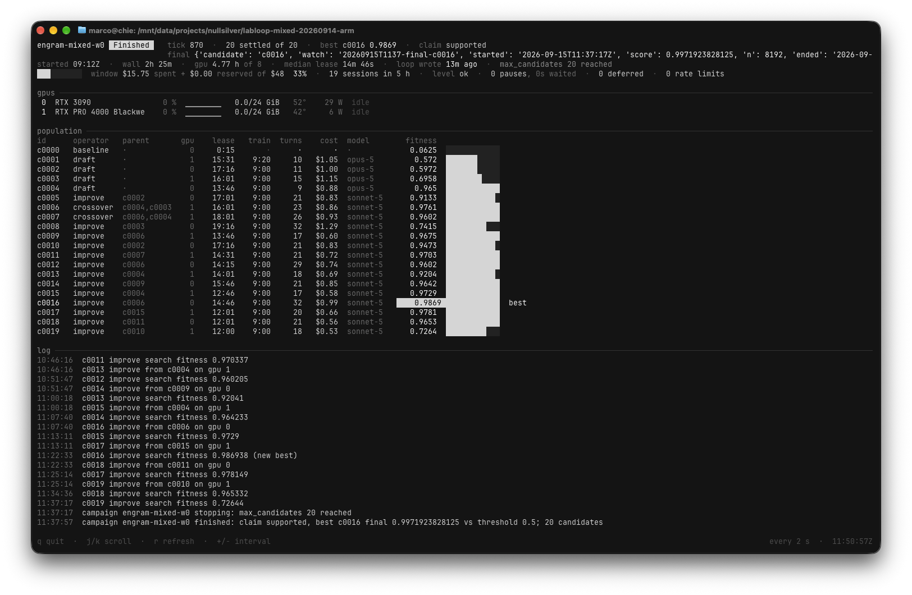

<p align="center">
  <picture>
    <source media="(prefers-color-scheme: dark)" srcset="docs/assets/labloop@256-dark.png">
    <source media="(prefers-color-scheme: light)" srcset="docs/assets/labloop@256-light.png">
    
  </picture>
</p>

# labloop

One repo is one research campaign. You write `campaign.toml`: the task, the evaluator,
the baseline, the budgets, and a success threshold fixed before anything runs. Then
`tools/lab run` searches. A population of candidates, a mechanical scheduler that picks
a parent and an operator, one short headless coding-agent session per job, fitness from
a hidden split that only `lab eval` can read, and a final split read exactly once at the
end.

The loop follows AIRA₂ (Meta FAIR, arXiv 2603.26499): `draft`, `improve`, `crossover`
and `debug` operators, temperature-scaled rank selection over search fitness, lineage
summaries as the only memory, one hidden consistent evaluation split. What labloop adds
is what a local box with one or two GPUs and a subscription requires: watchers with
budgets, restart-safe bookkeeping on the filesystem, privilege-separated labels, and a
usage governor that treats the subscription's rolling window as a resource. It derives
from [marcodsn/labloop](https://github.com/marcodsn/labloop) and keeps its values:
pre-registration, numeric thresholds, honest claims, evidence never deleted.

A good score during the search is not a result. Those scores decide which candidates to
pursue, so they are optimistic by construction. Only the one read of the final split,
against the threshold fixed before the search began, supports a claim. Failed, invalid,
killed and deferred candidates stay in the population with their reasons. The rules the
lab is run by are in [CLAUDE.md](CLAUDE.md), which is judgment rather than procedure:
honesty over optimism, baselines mandatory, evidence immutable, compute spent like
money.

Two machine-readable files, `population.json` and `events.jsonl`, describe a campaign in
a published format, so a site such as [nullsilver.com](https://nullsilver.com) can render
a project that opts in.

**Status: experimental.** The loop is exercised end to end by `scripts/acceptance.sh`
without an LLM, and has run live on MNIST and CIFAR-10. Status is in NEXT.md, design in
[docs/aira2-loop-design.md](docs/aira2-loop-design.md).

## The loop

```
campaign.toml ──► lab run ──► [ select parent → worker → evaluate → add to population ] ──► REPORT.md
                    ▲                                                                       │
                    └──────────────── until a stop condition ────────────────────────────────┘
```

Every tick, `lab run` reaps finished jobs (reads `fitness.json`, writes the LEDGER row),
enforces budgets (GPU-hours, the usage window), dispatches while a slot is free, and
stops on a stop condition. Dispatch order is the baseline first, then the drafts, then
`improve` with p = 0.85 or `crossover` with p = 0.15 on rank-selected parents, with
`debug` on a failed candidate under its retry cap. When it stops it freezes the best
candidate by search fitness, runs it once on the final split, writes `REPORT.md` with
the claim against the pre-fixed threshold, and exits. Kill it and start it again: it
resumes from `population.json` and the candidate dirs.

| status | meaning |
|---|---|
| `running` | searching |
| `waiting_usage` | the usage governor paused dispatch; `next_eligible` says until when |
| `stopping` | a stop condition fired; running jobs finish, then the final read |
| `finished` | `REPORT.md` written; claim `supported`, `not_supported` or `inconclusive` |



`tools/lab campaign status` after a campaign finished: the header line with the claim
and the one final score, the usage window, the GPUs, the population with operator,
parent, lease, turns, cost and search fitness per candidate, and the loop's log.

## Starting a campaign

1. Scaffold a project: `tools/lab campaign init <id>` writes `campaign.toml`, `task.md`,
   `eval/score.py`, `eval/baseline.sh` and the data dirs.
2. Write the task, the evaluator and the baseline. The evaluator is stdlib Python taking
   `<predictions> <labels_dir>` and printing `{"score", "n"}`. The labels of the search
   and final splits live outside the repo, under `$LAB_PRIVATE`.
3. Fix the threshold in `campaign.toml` before running. It is reported against at the
   end and blocks nothing. A changed `campaign.toml` is a new campaign.
4. Check and run:
   ```sh
   export LAB_PRIVATE=~/.local/share/labloop-private
   tools/lab campaign check
   tools/lab watch start --op campaign --budget-min 1500 -- tools/lab run campaign.toml
   tools/lab campaign status          # live view from another shell (--once for one frame, --plain for text)
   tools/lab campaign usage           # the usage governor's view
   tools/lab serve                    # the same, as a page on http://<this host>:8791/
   tools/lab campaign stop [--now]    # stop dispatching (and kill running jobs)
   ```
5. Read `REPORT.md` when it finishes: baseline, best by search, the one final score, the
   threshold, GPU-hours, usage, deferrals.

Everything else a new project needs is in [docs/campaign-setup.md](docs/campaign-setup.md):
the Python environment workers use, trusting the project dir once so headless Claude Code
sessions honour the allow-list, the optional `labeval` user, calibrating the usage
budget, and the Pi harness. Check the plumbing before trusting it with compute:
`scripts/acceptance.sh` runs the loop with scripted workers and a fake CLI, no LLM
involved.

## Two harnesses

The worker model id picks the harness, so a campaign does not configure one.

`claude-…` runs the job through Claude Code on subscription login, in
`tools/lab-worker`. A `provider/model` id, for example `local/gpt-oss-20b`, runs it
through [Pi](https://pi.dev) in `tools/lab-worker-pi`, against whatever that provider is
in Pi's own `models.json`. The two mix per operator: a Claude draft where the approach is
chosen, local improves for the many jobs that follow.

For local models, `scripts/llm-server.sh` runs llama.cpp's CUDA server on one GGUF,
pinned to one GPU and bound to localhost. It is a service, not a job: started once
outside any campaign, shared by every client on the host, never started or stopped by
`lab run`, which only checks before it starts that the endpoint serves the requested
model id. Pi is configured the way Pi documents it, in `~/.pi/agent/models.json`, so a
fork can point workers at any OpenAI-compatible server or hosted API without touching
labloop.

A Pi session gets the same contract as a Claude one: the turn budget, the evidence
guard, the refusal to read label paths and a bounded bash timeout, all from
`tools/pi/lab-worker.js`, loaded explicitly with nothing else discovered. Pi's event
stream and session file are kept beside the candidate, and `session.json` has the same
shape for both harnesses.

Two MNIST probes on 2026-09-15 ([docs/pi-probe-20260915.md](docs/pi-probe-20260915.md))
re-ran the M1 task, five candidates each, against the same pre-fixed 0.985: gpt-oss-20b
scored 0.9888 on the final split, Qwen3.8-27B Q4_K_M scored 0.9937, and M1 itself, Claude
Code on Sonnet, scored 0.9875. All three are supported at that threshold. This is
feasibility only. Five candidates on MNIST sit at the noise floor, so it is not a
comparison of models.

## What you own, what the lab owns

Yours: `campaign.toml`, the task statement, the evaluator, the baseline. The lab never
edits them, and refuses to continue a campaign whose file changed.

The lab's: the population. Candidate dirs, `population.json`, `LEDGER.md`,
`events.jsonl`, `finding.json` and `REPORT.md` are written only by `tools/lab` and never
deleted. A failed, killed, invalid or deferred candidate is evidence. A worker writes
only inside its own candidate dir, never reads labels, and never spawns a second session.

## Layout

```
campaign.toml        # the campaign: task, data, evaluator, budgets, threshold   (YOU write)
task.md              # the task statement workers receive verbatim              (YOU write)
eval/                # score.py and the trivial baseline                         (YOU write)
data/                # train (readable) and the inputs of the hidden splits
$LAB_PRIVATE/<id>/   # the hidden splits' labels, outside the repo
population.json      # the live state of the campaign                            (lab writes)
candidates/cNNNN/    # config.json, job.json, code/, summary.md, fitness.json, finding.json, session.json
LEDGER.md            # one row per candidate, ever                               (lab writes)
events.jsonl         # append-only public feed                                   (lab writes)
REPORT.md            # written once, at the end                                  (lab writes)
FORMAT.json          # the output-format contract, for machine consumers         (generated)
tools/lab            # the CLI, the only writer of the machine files
tools/lab_campaign.py  # the loop
tools/lab-worker     # one headless Claude Code session per job (hands Pi ids to lab-worker-pi)
tools/lab-worker-pi  # the same job as one headless Pi session: local or hosted open models
tools/pi/            # the Pi extension: turn budget and the evidence guard, loaded per session
scripts/llm-server.sh  # a llama.cpp server for local GGUFs, started outside the campaign
.claude/             # settings and hooks (guard, session briefing)
docs/                # campaign-setup.md, labeval.md, the dated result write-ups
scripts/             # acceptance.sh and its fixtures, sync-project.sh
```

A candidate dir is the unit of evidence. `config.json` holds the operator, the parents,
the seed, the git commit, the command, the hardware, the package versions and the model
provenance. `job.json` is what the worker was told. Then the candidate's own `code/`, and
`summary.md`, written when the candidate ends, including when it was killed, saying so
and why. `fitness.json` is written by `lab eval` and nothing else. `session.json` is the
worker session's result: turns, list-price cost, model. When the campaign opts into
finding cards, `finding.json` is written once by `lab run` after the candidate settles,
which keeps the worker's report apart from the measured search score.

### Which model ran it

Two facts, kept apart. Requested is the worker model named in `campaign.toml`. Served is
what actually answered, read from the session result the worker stores (`session.json`,
`modelUsage`). Both land in the candidate's `config.json` under `agent`, with their
sources. `lab usage` reads every session's transcript for token counts; `lab campaign
usage` reads the list-price cost per candidate.

## `tools/lab`

Zero dependencies beyond Python 3, and the only legal writer of the machine files:
`population.json`, `LEDGER.md`, `events.jsonl`, `fitness.json`, `finding.json` and
`FORMAT.json`. A `PreToolUse` hook blocks hand-edits, by a shell command or by the
Write and Edit tools.

```
lab campaign init <id> | check | status | usage [--json] | stop [--now]
lab run [campaign.toml] [--once --poll-sec N]
lab candidate list
lab eval <candidate dir> [--split search]       the only reader of labels; final is never on request
lab job card <candidate dir>                     the job card a worker receives
                                                 (under finding cards, the stored findings snapshot)
lab watch start --op NAME --budget-min N [--stall-min N --kill-regex RE] -- <cmd>
lab watch list | check | kill <id> --reason … | close <id>
lab serve [--bind 0.0.0.0] [--port 8791]        read-only page for the LAN: population, timeline, report
lab log <type> --msg "…" [--data '{…}'] [--candidate <id>]
lab events tail -n 20 [--class news|activity]
lab usage [--since YYYY-MM-DD] [--json]
lab validate
lab format show | sync | version
```

## Format versioning

Everything here is parsed by machines, so every artifact declares the format it was
written in. `FORMAT.json` at the repo root publishes the whole contract: file locations,
campaign and candidate statuses, operators, claims, the feed class of every event type,
provenance locations, and the limits. A consumer should build its filters from that file
rather than from this README.

`population.json` carries `format`, restamped on every write, and so does each
candidate's `config.json`. Every event carries its own `format`, fixed at write time:
`events.jsonl` is append-only, so a long-running project's feed may contain lines written
by several versions of `lab`, and a per-line stamp means a consumer never has to guess
which rules applied to a given line.

`FORMAT.json` is generated from the constants in `tools/lab` and `tools/lab_campaign.py`.
Never hand-edit it. `lab validate` fails if it has drifted from the code or declares a
version the lab does not write.

Bump policy. MAJOR when a consumer that ignored the change would misread the data: a key
renamed or removed, a status renamed, an event type's feed class changed, a limit
tightened. MINOR for additive changes it can safely ignore: a new event type, a new
optional key.

| version | change |
|---|---|
| 1.0 | initial contract: the six-phase state machine, `state.json`, trials, gates |
| 1.1 | additive: model provenance, requested vs served |
| 1.2 | additive: `note` event type |
| 1.3 | additive: `trial.verdict` event type |
| 1.4 | additive: the campaign loop's events beside the phase vocabulary |
| 2.0 | the phase machine is gone. `state.json`, phases, gates, protocol revisions, trials, sessions, predictions and their event types are removed. Events carry `campaign` and `candidate` instead of `phase`/`run`/`revision`. `population.json` is the live state; `FORMAT.json` publishes campaign/candidate statuses, operators and claims |
| 2.1 | additive: opt-in finding cards. `candidates/cNNNN/finding.json`, `population.json` `memory`, `job.json` `findings`, `FORMAT.json` `memory` section |

## The event feed

`events.jsonl` is written to be published as it is, in a public repo or by a site tailing
it, so `lab` enforces the contract mechanically: a closed set of event types, `msg`
collapsed to one line and truncated at 140 chars, events capped at 4 KB, `metric` events
throttled to one per candidate per minute, and redaction always. Redaction covers `sk-…`,
`AKIA…`, `hf_…`, `ghp_…`, bearer tokens, and the literal values of every env var named in
`.lab-redact`.

Each type has a fixed feed class. `news` (`campaign.start`, `campaign.stop`) is eligible
for a homepage and RSS. `activity` (`candidate.launch`, `candidate.done`,
`candidate.failed`, `campaign.paused`, `note`, `error`) is for a project timeline only.
`metric` is chart data and never a feed item. The authoritative table is `FORMAT.json` →
`events.types`.

Set `NULLSILVER_INGEST_URL` (and `NULLSILVER_TOKEN`) for realtime push. It is best-effort
and silent on failure, because git is the source of truth and the site backfills on push.

## Configuration

Model, turn budget, GPUs, wall clocks, stop conditions and the usage budget all live in
`campaign.toml`. `lab campaign check` validates it and `templates/campaign.toml`
documents every key.

Trust the project directory once for Claude Code before the first run: open `claude`
there and accept the dialog, or set `hasTrustDialogAccepted` for the path in
`~/.claude.json`. Until you do, headless sessions ignore the `permissions.allow` entries
in `.claude/settings.json` for that workspace, hooks still run, and they lose more actions
to auto-deny than they need to. Pi workers need no trust: the wrapper passes
`--no-approve` and loads only the lab's extension.

Claude Code workers run with `--permission-mode auto`: anything the classifier will not
approve is auto-denied rather than prompting, so an unattended loop can never hang. A
worker can lose an action instead, and the contract check turns that into an invalid
candidate, never a silent success. The `permissions.deny` rules in
`.claude/settings.json` and the evidence guard hook stay on either way.

## License

MIT, see `LICENSE`.
